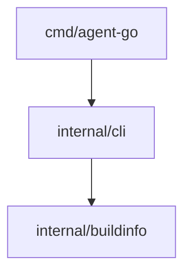

# Architecture

This page maps the [specification](spec.md) onto packages and owns module boundaries. Behavior
lives in the specification; update this page in the same change that adds a package or an
import edge.

## Repository layout

```text
agent-go/
|-- cmd/agent-go/main.go     process wiring: signal context, streams, os.Exit(cli.Run(...))
|-- internal/
|   |-- cli/                 command-line contract: parsing, usage, logger, exit codes
|   `-- buildinfo/           build identity from runtime/debug
|-- tools/plancheck/         dev-only command: plan lint, doc links, plan status
|-- tools/dist/              dev-only command: release archives and SHA256SUMS
|-- test/                    black-box tests and shared test data (see test/README.md)
|-- make/                    Makefile fragments included by the root Makefile
|-- docs/openspec/           specification, architecture, capability page template
|-- docs/impl/               plan.md, current.md, current/, records/
|-- docs/guide/              planning workflow, development guide
|-- .github/workflows/       ci.yml (make ci, race, dist); release.yml (tag -> GitHub release)
|-- AGENTS.md                canonical agent rules; CLAUDE.md, GEMINI.md, .cursor/ point to it
|-- Makefile                 entry point: includes make/*.mk and prints help
`-- go.mod, go.sum           module, Go version and pinned tools
```

Directories from the [Go project layout](https://github.com/golang-standards/project-layout)
are added only when needed: `pkg/` for code other modules import, `scripts/` for shell,
`configs/` for configuration templates, `build/` for packaging.

## Dependency direction



- `cmd/*` imports only `internal/cli`.
- `internal/cli` is the only product package that reads flags or the environment, writes to
  stdout or stderr, or decides an exit code. It builds typed configuration and passes it down.
- Domain packages never import `internal/cli`. Imports between them follow the edges drawn here;
  draw a new edge before adding the import, and never create a cycle.
- `tools/` and `test/` may import `internal/` packages; product code never imports them.

## Runtime model

- `main` creates a context canceled by SIGINT or SIGTERM and exits with the code `cli.Run`
  returns.
- `cli.Run` parses the command line, builds one `*slog.Logger` writing to stderr, runs the
  command and maps its error: `errUsage` to 2, `context.Canceled` to 130, anything else to 1.
- Long-running or blocking functions take the context first and return its error when canceled.
- Concurrency, when a capability needs it, uses bounded worker pools owned by the function that
  starts them, waits for every goroutine, and keeps output order deterministic.
